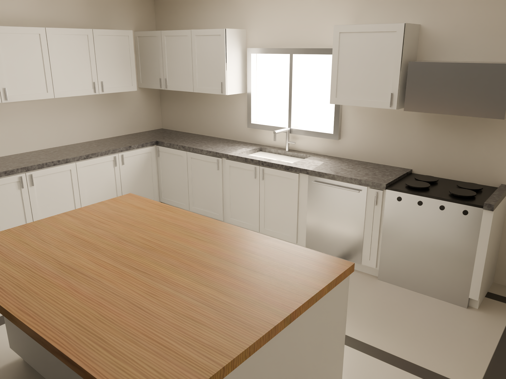

# 3D Kitchen — Configurator

An interactive kitchen configurator: a photoreal L-shaped kitchen modeled in **Blender**, exported to **glTF**, and rendered in the browser with **React Three Fiber**, where customers can swap finishes live.



## Pipeline

```
Blender scene  →  bake textures  →  glTF (.glb)  →  React Three Fiber app
(blender/)        (export/textures/) (web/public/)   (web/)
```

- **`blender/`** — the scene as code. `kitchen_build.py` is an idempotent full rebuild (room, L-shaped shaker cabinets, appliances, island, lighting, camera). `bake_export.py` unwraps + bakes the procedural materials to image textures and exports the GLB. Driven over the Blender MCP bridge via `bridge_client.py`.
- **`export/`** — the exported `kitchen.glb` and baked base-color textures.
- **`renders/`** — Cycles stills. `final_cycles.png` is the hero shot.
- **`web/`** — the configurator (Vite + React + TypeScript + R3F). Loads `public/kitchen.glb` and swaps materials by name.

## Web app

```bash
cd web
npm install
npm run dev      # http://localhost:5173
npm run build    # typechecks + builds to dist/
```

### How finish swapping works

Materials in the GLB carry stable contract names (`MAT_cabinet`, `MAT_counter_granite`,
`MAT_floor_tile`, `MAT_butcher_block`, `MAT_steel`, `MAT_cooktop_black`, `MAT_wall`,
`MAT_glass`). The app caches each mesh's original material on load, then swaps by material
name — cabinet finish, countertop, and floor are independently configurable, with the
baked originals restored for the default options.

## Deployment

The web app deploys on **Vercel** with the root directory set to `web/` (Vite preset,
build `npm run build`, output `dist`).
